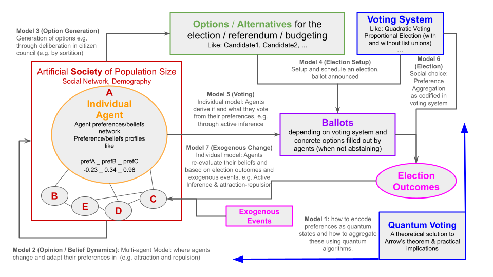
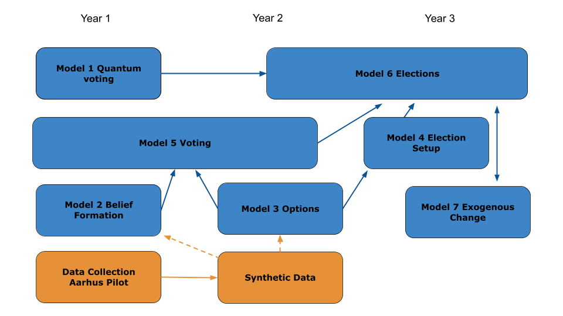

# Goal

We build a stack of models that simulate the process of preference formation and an election in the electorate of the population of **Aarhus**. Once for the municipal election and once for the national election. 

First, we will focus on the **municipal election**.


# Data-driven agent-based modeling

The modeling process is **data-driven** [@Lorenz2021DatadrivenAgentbasedModeling]. That means, empirical data is used for [exploratory data analysis](data-driven_ABM.qmd#exploratory-data-analysis) and  [initialization](data-driven_ABM.qmd#initialization), [calibration](data-driven_ABM.qmd#calibration), and [validation](data-driven_ABM.qmd#validation) of the model. Details about the data-driven modeling process can be found in the [data-driven ABM part](data-driven_ABM.qmd).


# Models

As specifiec in the proposal and the Specification Document D04.1, we have a stack of 6 models that are connected to each other as shown in the @fig-modelplan. Here we specify this chain of models further with the goal to implent the first prototype. To that end, we also give an overview of the data sources used for initialization and validation.

::: {#fig-modelplan layout-ncol=2}





Modeling plan from the proposal (left) and the Specification Document D04.1 (right).
:::

We focus on the following models in the first prototype in the following form:

Model 2: **Preference Formation** (how agents form their preferences)    
Model 3: Candidates and Parties (set up exogenously from data)     
Model 4: Election Setup  (set up as the orignal voting system in Aarhus and then alternative voting systems)  
Model 5: **Voting**    
Model 6: Election (aggregation of votes into results)


# Data Sources

These are the data sources we use for initialization and validation of the models. Additionally, some data sources are also used as input data in model simulation.

- **Aarhus Census**: Census data for the population of Aarhus
- **Aarhus News Corpus**: A corpus of local news articles from the last year in Aarhus tagged for the local topics in the survey.
- **Aarhus Survey**: Survey responses about beliefs, preference on national and local issues, and voting behavior in the last election. 
- **Aarhus Candidates**: Candidate profiles for all participating candidates in the last municipal election in Aarhus.
- **Aarhus Election Results**: Results from the last municipal election in Aarhus. Results from the last national election in Aarhus.


# Model Overview

@fig-model-overview gives the full outline the models and their connections to each other and to the data sources. The full model flow is shown in the bottom part (Greenish), the data sources in the top part (blue), and the algorithms for initialization (purple) and validation (magenta) in the middle part. The arrows show the flow of data and information between the different components.

Nodes with the *note-shape* (with the dog-ear on the topright) represent **raw empirical data sources**. Nodes with the *box-shape* represent **algorithms** for initialization, validation, or simulation procedures, while *double-lined boxes* represent **substantial (multistep) algorithms** and single-line procedures represent mainly one **function** determining the validation or election outcome computation. Nodes with the *cylinder-shape* represent simulated data which by initialization or model procedures. The validation nodes are rounded boxes. This represents that validation can be function determining the quality of the match between emprical and simulated data but may also be in part qualitatively done in the first place. 

```{dot}
//| label: fig-model-overview
//| fig-height: 3
//| fig-cap: "Model Overview"

digraph G {
  layout=neato
  overlap=false
  splines=true
  node [fontname="Source Sans Pro", fontsize=16]
  edge [fontname="Source Sans Pro", fontsize=11]

  // Empirical data type
  subgraph cluster_empirical {
    label="Empirical Data"
    color=transparent
    node [shape=note, style=filled, fillcolor="#c1cffc", color="#3246f9"]
    census    [label="Aarhus\nCensus",        pos="0,4!"]
    survey    [label="Aarhus\nSurvey",        pos="4.75,4!"]
    news      [label="Aarhus\nNews Corpus",           pos="2,4!"]
    candidate [label="Aarhus\nCandidate\nProfiles\n(Model 3)", pos="7.5,4!"]
    votSys    [label="Voting System\n(Model 4)", shape=box,peripheries=2, pos="9.6,4!"]
    results   [label="Aarhus\nElection Results",      pos="12.5,4!"]
  }

  // Algorithms type
  subgraph cluster_algorithms {
    label="Algorithms"
    color=transparent
    node [shape=box, style=filled, fillcolor="#edb9fb", color="#952bb3"]
    init1   [label="Initialization 1", peripheries=2, pos="0,2!"]
    init2   [label="Initialization 2", peripheries=2, pos="5.7,2!"]
  }  
  
  subgraph cluster_validationFunctions {
    label="Algorithms"
    color=transparent
    node [shape=box, style="filled,rounded", fillcolor="#feb3d8", color="#b21360"]
    valid1  [label="Validation 1\n(Preferences)", pos="3.8,2!"]
    valid2  [label="Validation 2\n(Votes)", pos="9.5,2!"]
    valid3  [label="Validation 3\n(Results)", pos="12.5,2!"]
  }

  // Models & simulation type
  subgraph cluster_simulation1 {
    label="Models"
    color=transparent
    node [shape=cylinder, style=filled, fillcolor="#abfce9", color="#0fc8b0"]
    agents1   [label="Agents for\nPreference\nFormation", pos="0,0!"]
    prefModel [label="Preference\nFormation\n(Model 2)", shape=box, peripheries=2, pos="2,0!"]
    agents2   [label="Agents for\nVoting", pos="4,0!"]
  }

  // Models & simulation-data 2
  subgraph cluster_simulation2 {
    label="Models"
    color=transparent
    node [shape=cylinder, style=filled, fillcolor="#b8ff92", color="#47bb09"]
    agents3   [label="Agents for\nVoting", pos="5.5,0!"]
    voteModel [label="Voting\n(Model 5)", shape=box, peripheries=2, pos="7.5,0!"]
    agents4   [label="Agents with\nBallots", pos="9.5,0!"]
    election  [label="Election\n(Model 6)", shape=box, pos="11,0!"]
    resultsSim [label="Simulated\nResults", pos="12.5,0!"]
  }

  // edges
  census -> init1
  census -> init2
  news -> prefModel
  survey -> init1 [style="dashed"]
  survey -> init2
  survey -> valid1
  survey -> valid2
  candidate -> prefModel [style="dashed"]
  candidate -> voteModel
  candidate -> valid2
  results -> valid3

  init1 -> agents1
  agents2 -> valid1
  init2 -> agents3
  agents4 -> valid2
  votSys -> voteModel
  votSys -> election
  resultsSim -> valid3
  
  agents1 -> prefModel
  prefModel -> agents2
  agents2 -> agents3 [style="dashed"]
  agents3 -> voteModel
  voteModel -> agents4
  agents4 -> election
  election -> resultsSim
}
```

## Voting System

Besides the **five emprical data sources**, the [**Voting System**]{.boxed-data} is another source of empirical input. We implement the original Danish proportional voting system with open list composed by parties where each voter has one vote to either give to one candidate from a party list or just to one party list without specifying a candidate. Later the voting system shall be exchanged with other for counterfactual scenario simulations. The voting system has implications. The voting system determines the election setup (Model 4) based on the lists of candidates and, therefore, has implications on how the ballot looks and what voters have to decide about when they want to fill it out (Model 5). Subsequently it determines how the election results are computed from the ballots (Model 6).

## Initialization procedures

We have two initialization procedures. Both create a set of agents serving as a synthetic population representing the electorate of the city of Aarhus. Therefore, they both take the census data as input, such that they can create agents in the same magnitude and with demographic characteristics such that represent the real population. The procedures also take the survey data as input. This data is used to initialize agents also with relevant beliefs and preferences as the core dynamic agent variables and also with static internal variables of agents determining their behavior (to be explained later). 

[**Initialization 1**]{.boxed-init} is for initialization of the [Agents for Preference Formation]{.boxed-model1}. The preference formation model will transform these preferences through individual preference updates. The goal is that the [Agents for Voting]{.boxed-model1} have preference distributions and relations simular to the real world as captured in the survey data. The core *dynamic variables* model are therefore the preferences. That means the variables `ALCL1`, ..., `ALCL10`. When the distributions and relations of these variables shall emerge through preference formation, the initial values of these variables should not be set based on the survey data but rather be initialized randomly around neutrality. 

This implies the following guidelines for [**Initialization 1**]{.boxed-init}:

- The variables `ALCL1`, ..., `ALCL10` shall be initialized as random numbers^[Using a bell shaped distribution, either a normal distribution with capped values whern they exceed the maximal preference values, or a corresponding Beta distribution scaled such that maximal and minimal values correspond to the preference bounds] centered around neutrality (value equal to zero). The standard deviation of the distribution is a tuning parameter $\sigma_\text{Pref}$. Roughly three settings are of interest:
    - $\sigma_\text{Pref} = 0$ (default): All agents start with zero on all preferences and the distribution emerges through external input through news and candidates and through reinforcement. 
    - $\sigma_\text{Pref}$ close to zero: The initial values can serve as a small nudge. 
    - $\sigma_\text{Pref}$ as in the survey data: The preference formation model must than not produce variance but sort preference relations and specific distribution patterns beyond normal distributions. 
- The agents need some heterogeneity in relevant **static internal variables** determining their behavior. Candidates for such static variables are:
    1. Three **topics of interest** as encoded in variable survey variable `ALCL11`. It could be encoded in ten binary variables marking if the topic is important for the agent.
    2. A correlation matrix representing the **mental model** of the agent about the relations between the different preferences. This can be initialized based on the correlation matrix derived from different demographic and subgroups of repondents of the survey data. The mental model can then determine how like an update of preferences is when they perceive news, or the preferences of candidates and peers.
    3. **Long-term party preferences** (taken, as a proxy, from the voting behavior as reported in the survey)  
    4. Variables derived from the survey data *Part 3: Opinion on Politics* specifying things like independence of political opinion formation or trust in others, curiousity for new opinions, propensity to proximity voting, preferences for people or parties, and other aspects. These aspects can be used to specify **behavioral rules** for agents in the preference formation model. 

First version: `ALCL1`, ..., `ALCL10` are initialized as zero and a mental model for them as a correlation matrix taken from data and demographics. A few different correlation matrices are enough for the first version. 

[**Initialization 2**]{.boxed-init} is for initialization of the [Agents for Voting]{.boxed-model2}. The voting model will transform these preferences and produces [Agents with ballots]{.boxed-model2}. The goal is that the votes of the agents are similar to the real votes as captured in the survey data. The intialization procedure thus follows the main idea of a synthetic population with the same charaterstics as the real population. The simplest version would be by resampling from repsondents of the survey data. More sophisticated versions should be able to increase the diversity of agents in a realistic way.  

Note: The Aarhus survey fulfills *different roles* in the Preference Formation and the Voting model. In the first, it is used mostly for validation of the outcome of preference formation and only a few aspects are used for agent initialization. In the second, the survey data is mainly used for intitialization while the empirical validation in the end is on the election results. That is the reason for [Agents for Voting]{.boxed-model1} and [Agents for Voting]{.boxed-model2} appearing two times in the simulation pipeline. This reflects that the pipeline is divided into the independent models of preference formation and the voting. At later stage, they can be combined into a single model.

## Validation functions

We have three validation functions. The first one is for validating the outcome of the preference formation model. The second one is for validating the votes of agents in the voting model, and the third one is for validating the election results. 

[**Validation 1**]{.boxed-valid} The goal is that the distribution of simulated preferences and their relations are similar to the survey data. Therefore, we can use distributional similarity metrics and correlation similarity metrics as validation functions. 

[**Validation 2**]{.boxed-valid} is for validating the votes of agents in the voting model. The goal is that individual voting decisions based on the preferences are similar to the actual voting decisions as reported by respondents in the survey. Therefore, we can use  classification metrics as validation functions.

[**Validation 3**]{.boxed-valid} is for validating the election results. The goal is that the aggregated simulated election results are similar to the real election results. Therefore, we can use distance metrics between distributions as validation functions. The difference to *Validation 2* is that we are not validating the individual votes but the aggregated election results.

## Simulation procedures

The [**Preference Formation**]{.boxed-model1} model is a dynamic multi-timestep model where agents update their preferences based on their interaction but also with external input from news and candidates. Details are described 

The [**Voting**]{.boxed-model2} model is a one-shot model that takes the preferences of agents and the candidate and party profiles as input and produces a ballot (or an abstention) for each agent. In the default voting system the ballot is essentially a choice of one candidate or one party. In alternative voting systems, the ballot can be more complex. 

The [**Election**]{.boxed-model2} is the simple aggregation of all ballots to the typical voting outcome: Counts of votes for all parties and candidates and the vote shares of parties. 


# Preference Formation Model

@fig-preference-formation-overview gives an overview of the preference formation model including the necessary initialization steps. The model is a dynamic multi-timestep model where agents update their preferences based on their interaction but also with external input from news and candidates.

```{mermaid}
%%| label: fig-preference-formation-overview
%%| fig-height: 5
%%| fig-cap: "Preference Formation Sequence Diagram"
 
sequenceDiagram
    participant Configurator
    participant Polis
    actor Agent
    actor AgentPeer as Agents (peers)

    rect rgb(237, 185, 251)
    Note over Configurator, AgentPeer: Initialization 1 and News Initialization 
    Configurator->>Polis: initialize news
    Configurator->>Agent: initialize preferences
    end

    rect rgb(171, 252, 233)
    Note over Configurator, AgentPeer: Preference Formation per-timestep preference update
    loop each simulation step (day)
    Note over Polis, Agent: Broadcasting preferences
        Polis->>Polis: broadcast(news)
    Polis->>Polis: broadcast(news)
    loop each agent
        Agent->>Agent: broadcast(preference)
    end
    Note over Polis, AgentPeer: Perceive and update preferences
    loop each agent
        Agent->>Polis: perceive(news)
        Agent->>AgentPeer: perceive(peers)
        Agent->>Agent: updatePreferences()
    end
    end
    end
```

Note: Agents (peers) stands prototypical for the other agents in the population. 

## Specification of the initialization

In the most basic version, the initialization of agents must include: 

- Dynamic variables: The preferences `ALCL1`, ..., `ALCL10` initialized as zero. 
- Static internal variables: A mental model for the preferences as a correlation matrix taken from data and demographics.

The preference variables in the survey all have values in $\{-2,-1,0,1,2\}$, where -2 and 2 represent the strongest negative and positive preferences, respectively. In the simulation model, we use continuous values in the same range $[-2, 2]$. The latter allows for more fine-grained updates.

## Specification of the preference formation model functions 

The simulation loops over several time steps. In each time step, agents broadcast their preferences and perceive the news and the preferences of their peers. Based on this input, they update their preferences. 

A broadcasted news item has the same format as a broadcasted preference of an agent: It is a *key-value pair* where the key is one of the ten preference topics `ALCL1`, ..., `ALCL10` and the value is a number in the range $[-2, 2]$ like `ALCL1: 1.5`. 

Each timestep is separated into two phases. In the *broadcasting phase*, the `broadcast` function writes out the preference in an internal variable `broadcasted` such that it can be read by agents in the perception phase. 

In the simplest version (where we do not have a news dataset), `broadcast(news)` selects a random key and a random value. 

The simple version of `broadcast(preference)` is that the agent picks a random key and takes its current the writes out its current preferences.

In the *perception and update phase*, the `perceive` function reads the broadcasted news and preferences of peers. The `updatePreferences` function then updates the preferences based on the perceived news and peer preferences.

In the simple version, `perceive(news)` and `perceive(peers)` both are followed directly by an update function `updatePreferences` for the own preferences. In the simple version, `perceive(peers)` selects a random other agent to perceive its broadcasted preference. 

Given a perceived preference and the own preference profile `updatePreferences` updates the own preference of the same key or not by the procedure as specified by @BatzkeEtAl2025CognitiveCoherencePolitical. Central for this is a **mental model** specifying the correlation between different preferences which the agent considers relevant. (To be derive from data next.) 


[**Below only notes**]{.text-red}

# Pilot Study

1. Aarhus Municipality abstract lab game theoretic experiment resource allocation game with different voting systems.

4 Voting Rules

- First past the post
- Ranked Voting (with instant runoff)
- Quadratic Voting
- Majority required on plurality

2. Experiment